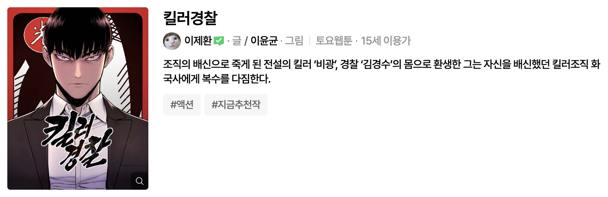
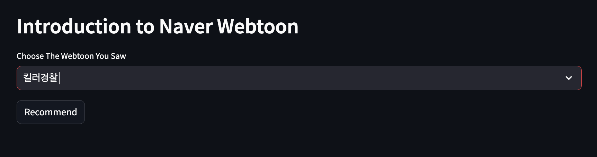

# Fall-In-Toon
**Fall-In-Toon**은 웹툰 제목을 입력 받아 비슷한 줄거리의 웹툰을 추천해준다.  
크롤링 파트에서 네이버 웹툰 페이지에서 연재중인 정기 및 비정기 연재 웹툰의 정보를 가져온다.  
모델링 파트에서 가져온 웹툰 정보의 줄거리를 기반으로 상위 20개의 웹툰을 추천해준다.  
도메인 파트에서 상위 20개 웹툰의 작화 정보를 위한 썸네일 이미지와 링크를 제공해준다.

## 목적
아나콘다 주피터 노트북을 사용해서 가상환경 호환 및 충돌 문제없이,  
아래의 파일 구성을 참고해서 순서를 따라가며 웹 페이지에서 정보를 크롤링하고,  
가져온 정보를 데이터셋으로 활용해 간단한 추천 프로그램을 만들어보자.

## 파일 구성
**[getContentsInformation.ipynb](https://github.com/woogie01/Fall-In-Toon/blob/d330bc34a1e76ab360aff26bebd46abf0aeb5be3/crawling/getContentsInformation.ipynb)**
- 네이버 웹툰 페이지에서 웹툰 정보 가져오기
- 제목, 줄거리, 장르, 썸네일 이미지 주소, 링크 주소
- Selenium : 로그인, 크롤링 자동화
- Pandas : 저장한 웹툰 정보 리스트를 CSV파일로 변환

**[getRecommendation.ipynb](https://github.com/woogie01/Fall-In-Toon/blob/f76feb53e613c86f96ef17565d5354888b0fd862/modeling/getRecommendation.ipynb)** 
- Okt(Open Korean Text) : 한글 형태소 분석
- 줄거리를 분석할 때 중요하게 생각하는 것 : 명사, 동사, 부사, 형용사
- 토큰화 한 줄거리를 벡터화 후 내적을 이용해 코사인 유사도를 분석
```python
from sklearn.metrics.pairwise import linear_kernel

# linear_kernel : cosine_similarity와 결과는 같지만 속도는 더 빠름
# tfidf_matrix 벡터 내적을 통해 코사인 값을 비교
cosine_sim = linear_kernel(tfidf_matrix, tfidf_matrix)
cosine_sim
```

**[Domain.py](https://github.com/woogie01/Fall-In-Toon/blob/f9b5f1629c60ac7f67f62421933cc539c8318fff/domain/Domain.py)**  
- 빠른 웹페이지 구현을 위해 Streamlit을 사용.
- 객체화 한 코사인 유사도 함수를 통해 상위 20개 웹툰을 추천.
## 사용법
1. Crawling을 위해 네이버 계정의 ID, Password를 입력.
```python
# 네이버 웹툰 로그인
user_id = 'naver_id'
user_pw = 'naver_password'
```
2. 웹 페이지 상에 추천 목록을 띄우기 위해 Launcher를 실행.
```terminal
streamlit run domain/Domain.py
```

## 실행 예시
웹툰 킬러경찰(복수,킬러,액션)에 대한 추천 목록


https://github.com/woogie01/Fall-In-Toon/assets/113490741/78acd4b8-001f-4d9c-a8aa-9f4d307217a5

<제목 입력>
  

<추천 목록 나열>  


## 아쉬운 점
1. 웹툰 상세 페이지의 줄거리가 정확하지 못하거나 매우 간단한 경우가 존재.
1. 웹툰 정보를 가져오는 플랫폼을 네이버, 카카오, 다음 등 다양하게 가져오기.
1. 크롤링으로 가져오는 속도가 매우 느려서 파일을 분리한 점.
1. 줄거리가 아닌 작화(그림체)를 기준으로 웹툰을 선택하는 사람도 있음.

## Reference
[Selenium with Python](https://selenium-python.readthedocs.io/)  
[파이썬 레시피 - 웹 활용입문](https://wikidocs.net/35949)  
[딥러닝을 이용한 자연어 처리 입문](https://wikidocs.net/24603)  
[Streamlit Documentation](https://docs.streamlit.io/library/api-reference/layout)  
[파이썬 활용편 - 머신러닝](https://nadocoding.tistory.com/92)


