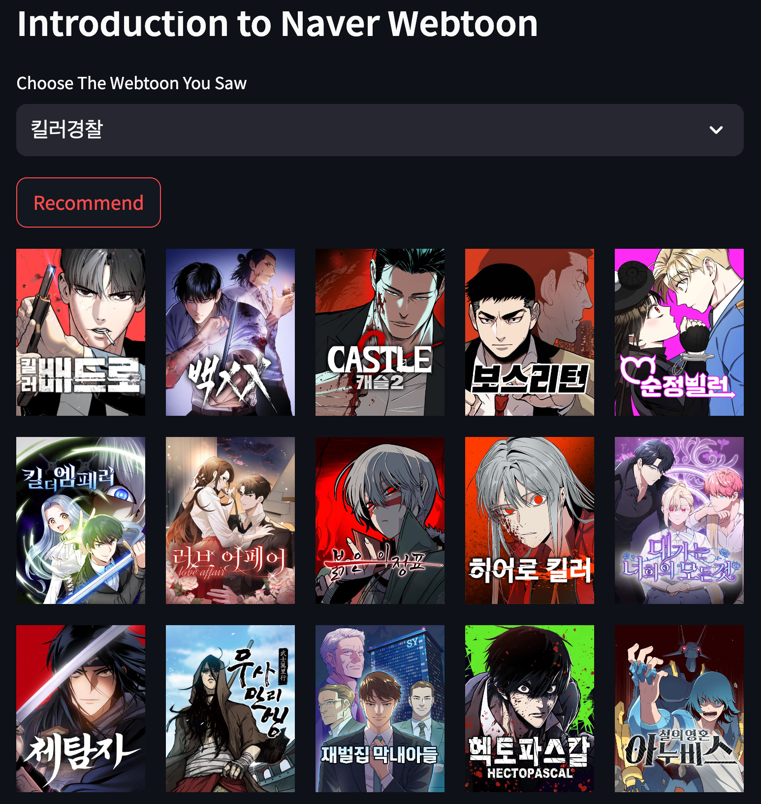

# Fall-In-Toon
**Fall-In-Toon**은 웹툰 제목을 입력 받아 비슷한 줄거리의 웹툰을 추천해준다.  
크롤링 파트에서 네이버 웹툰 페이지에서 연재중인 정기 및 비정기 연재 웹툰의 정보를 가져온다.  
모델링 파트에서 가져온 웹툰 정보의 줄거리를 기반으로 상위 20개의 웹툰을 추천해준다.  
도메인 파트에서 상위 20개 웹툰의 작화 정보를 위한 썸네일 이미지와 링크를 제공해준다.

## 목적
아나콘다 주피터 노트북을 사용해서 가상환경 호환 및 충돌 문제없이,  
아래의 파일 구성을 참고해서 순서를 따라가며 웹 페이지에서 정보를 크롤링하고,  
가져온 정보를 데이터셋으로 활용해 간단한 추천 프로그램을 만들어보자.

## 파일 구성
**[getContentsInformation.ipynb](https://github.com/woogie01/Fall-In-Toon/blob/219e34c295b41b0366b6c36c3aabf0b414a78c31/getContentsInformation.ipynb)**  
**[getRecommendation.ipynb](https://github.com/woogie01/Fall-In-Toon/blob/dff3b0b1b737b39200706c37813784c9df7bd6e6/getRecommendation.ipynb)**  
**[Domain.py](https://github.com/woogie01/Fall-In-Toon/blob/77b2a1adb838cd100af56ad534d79c3ab0526bb6/Launcher.py)**  

## 사용법
1. Crawling을 위해 네이버 계정의 ID, Password를 입력.
```python
# 네이버 웹툰 로그인
user_id = 'naver_id'
user_pw = 'naver_password'
```
2. 웹 페이지 상에 추천 목록을 띄우기 위해 Launcher를 실행.
```terminal
streamlit run domain/Domain.py
```

## 실행 예시
웹툰 킬러경찰(복수,킬러,액션)에 대한 추천 목록

<제목 입력>
  

<추천 목록 나열>  



## 아쉬운 점
1. 웹툰 상세 페이지의 줄거리가 정확하지 못하거나 매우 간단한 경우가 존재.
1. 웸툰 정보를 가져오는 플랫폼을 네이버, 카카오, 다음 등 다양하게 가져오기.
1. 크롤링으로 가져오는 속도가 매우 느려서 파일을 분리한 점.

## Reference
Selenium with Python(https://selenium-python.readthedocs.io/)  
파이썬 레시피 - 웹 활용입문(https://wikidocs.net/35949)  
딥러닝을 이용한 자연어 처리 입문(https://wikidocs.net/24603)  
Streamlit Documentation - Layouts and Containers  


